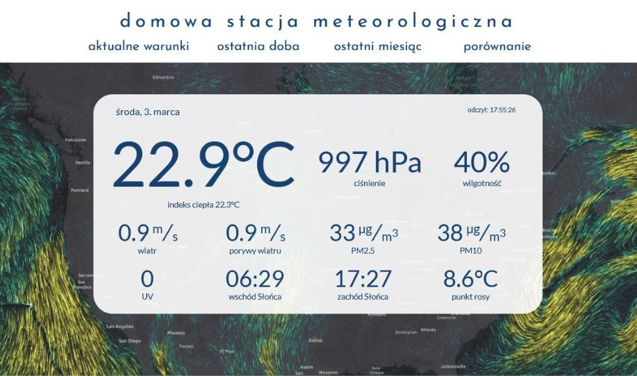
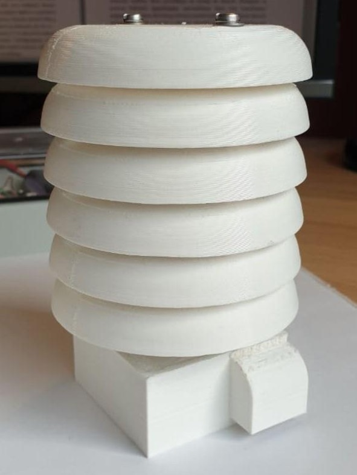
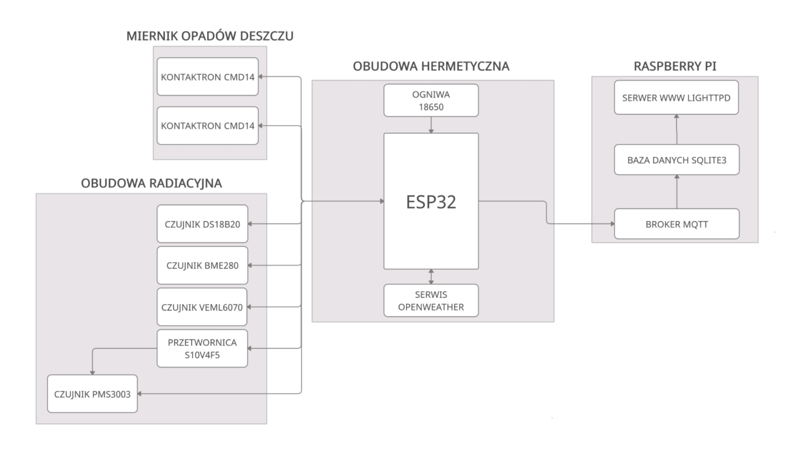

# Domowa stacja mateorologiczna

#### Projekt domowej stacji meteorologicznej wykorzystującej Raspberry Pi jako serwer i ESP32 z sensorami do pomiaru parametrów pogodowych.
#### Home weather station project based on Raspberry Pi as server and ESP32 with sensors for measuring weather parameters.

### Czujniki (sensors):
* DS18B20: temperatura
* BME280: ciśnienie atmosferyrczne i wilgotność względna
* VEML6070: promieniowanie UV
* PMS3003: zanieczyszczenie powietrza pyłami PM2,5 i PM10
* Pololu S10V4F5: przetwornica napięcia z 3,3 do 5 V dla PMS3003

### Raspberry Pi
ESP32 wysyła dane za pośrednictwem WiFi i MQTT do Raspberry Pi, na którym jest:
* Skrypt w Pythonie z Brokerem MQTT i obsługą bazy danych SQLite3
* Serwer WWW Lighttpd ze stroną internetową
* Python 3.7.3, SQLite3 3.27.2, Lighttpd 1.4.53, PHP 7.3.27

### ESP32
Co 10 minut wykonuje pomiary (PMS3003 co godzinę), łączy się z WiFi i wysyła dane do Brokera MQTT, w pozostałym czasie uśpione. Pomiar deszczu na zasadzie zliczania zwarć kontaktronu.

### Co warto kiedyś zrobić:
* Zmiana DS18B20 na SHT35
* Uwzględnienie wilgotności powietrza w pomiarze zanieczyszczenia powietrza
* Archiwizacja danych i stworzenie strony porównującej okresy (np. styczeń 2020 vs styczeń 2021)
* Zmiana backendu strony (Vue?)
* OpenWeather API przeniesione do Raspberry
* Zasilanie z paneli fotowoltaicznych lub porządna optymalziacja zużycia energii (+własne PCB?)

### Pliki .stl
Repo zawiera również pliki .stl i .ipt (Inventor 2020) części wydrukowanych na drukarce 3D. Obudowa radiacyjna z komorą na PMS3003:

### Schemat blokowy projektu

